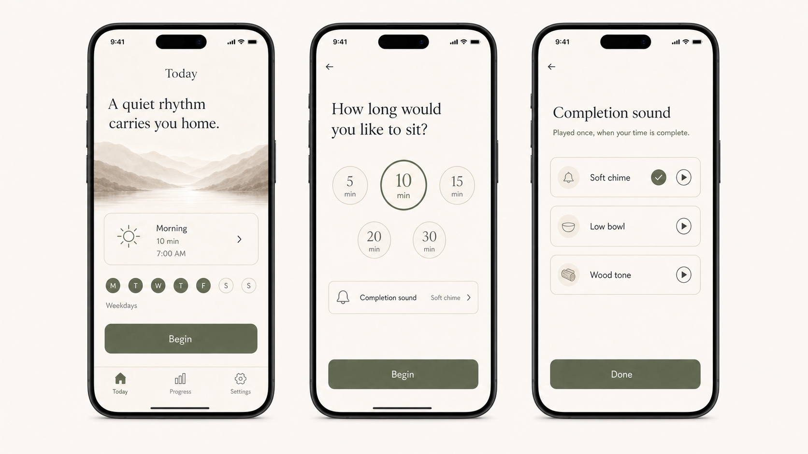

<div align="center">


# Zen

**A quiet rhythm for daily practice.**

Zen is a meditation companion that supports the practice without becoming the focus of it.

</div>



## Presence without pressure

Meditation asks for quiet. Most phone timers end it with an alarm.

Zen is designed around a gentler experience: choose how long you want to sit, begin with minimal ceremony, and return with a soft sound when the session is complete. Outside the session, flexible goals, subtle reminders, and thoughtful progress help a practice become regular without turning it into another obligation.

Zen is not a guided-meditation service or a content library. It is the calm structure around a person's own practice.

- **Sit without interruption.** Once a session begins, Zen asks for nothing.
- **Return gently.** Soft sound, restrained motion, and calm language replace the abrupt alarm.
- **Build a rhythm.** Flexible schedules and reminders make it easier to come back.
- **See progress without pressure.** Progress is encouraging and tangible, never punitive.

## Designed to recede

Zen's interface is warm, spacious, and purposefully quiet. The open ensō represents a practice that is alive rather than perfected: complete enough to hold the moment, open enough to begin again.

The visual system pairs an ink-and-mist foundation with a restrained moss accent, editorial Newsreader display type, clear Geist interface type, and motion that feels more like breath than spectacle.

The complete foundation lives in the repository:

- [Vision](./docs/VISION.md) — why Zen should exist and how it should feel.
- [Product](./docs/PRODUCT.md) — the core experience, boundaries, and open decisions.
- [Design system](./docs/design/README.md) — brand, screens, assets, and implementation tokens.
- [Brand specification](./docs/design/BRAND.md) — identity, colour, typography, layout, motion, sound, and voice.

## Project status

> [!NOTE]
> Zen is in active development. The product vision, brand system, core flows, and app theme are established; feature implementation is ongoing. The interfaces in this README show the high-fidelity product direction, not a released App Store build.

## Engineering

Zen is a TypeScript monorepo built for iOS, Android, and the web. The mobile app uses Expo and React Native; a Nitro server exposes a type-safe tRPC API that can be deployed to Cloudflare Workers.

| Layer     | Technology                                             |
| --------- | ------------------------------------------------------ |
| App       | Expo 57, React Native 0.86, React 19, Expo Router      |
| Interface | HeroUI Native, Uniwind, Tailwind CSS v4, Reanimated    |
| Data      | tRPC v11, TanStack Query, TanStack Form, Zod           |
| Server    | Nitro 3, Cloudflare Workers                            |
| Quality   | Strict TypeScript, Jest, Vitest, ESLint, Oxlint, Oxfmt |
| Workspace | pnpm, Turborepo                                        |

## Quick start

You will need the Node.js version in [`.node-version`](./.node-version), pnpm 11, and Xcode or Android Studio for native development.

```bash
git clone https://github.com/AdiRishi/zen-meditation.git
cd zen-meditation
pnpm install
```

Start the API server:

```bash
pnpm run server:dev
```

Then generate the native projects when needed and start the app in a second terminal:

```bash
pnpm run prebuild
pnpm ios

# Or:
pnpm android
pnpm web
```

## Everyday commands

| Command             | Purpose                                        |
| ------------------- | ---------------------------------------------- |
| `pnpm run check`    | Run lint, formatting checks, and TypeScript    |
| `pnpm run test`     | Run app and server tests                       |
| `pnpm run compile`  | Compile shared workspace packages              |
| `pnpm run format`   | Format the repository with Oxfmt               |
| `pnpm run prebuild` | Regenerate the native iOS and Android projects |

## Repository guide

```text
apps/mobile/     Expo app, routes, screens, and interface components
servers/api/     Nitro server and tRPC procedures
packages/        Shared contracts and TypeScript configuration
docs/            Product vision, design system, and architecture decisions
```

Architecture and workflow decisions are recorded in [`docs/adr`](./docs/adr/README.md). The local simulator validation workflow is documented in [`docs/agents/local-validation.md`](./docs/agents/local-validation.md).

## License

Zen is available under the [MIT License](./LICENSE).

---

<div align="center">

Made with ❤️

</div>
